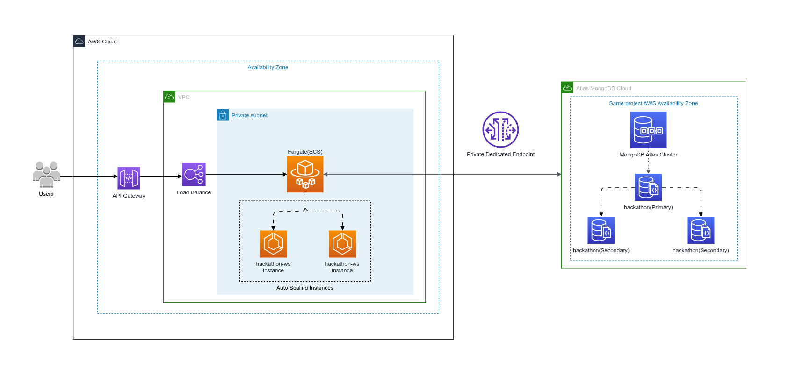
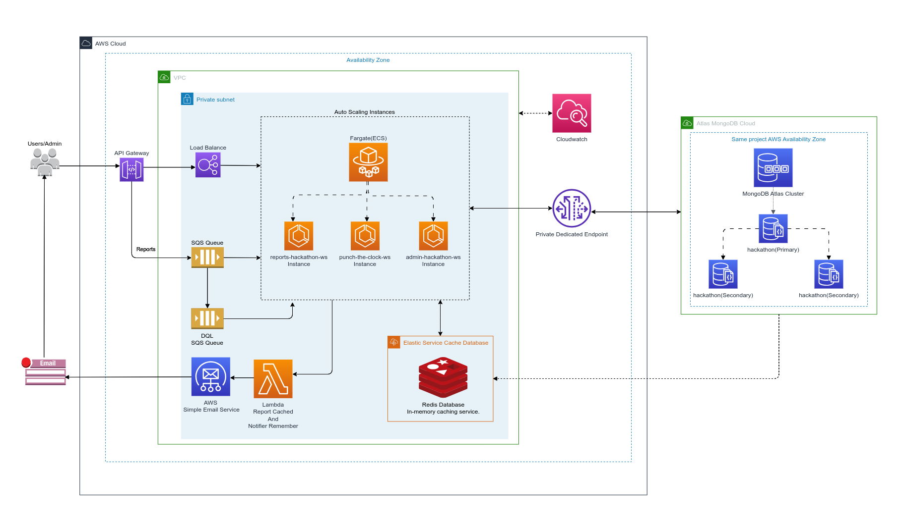

# MVP - Tech challenge hackathon-ws

## 💡 Requirements

- Java 17 or later - [SDKMAN - Recommendation](https://sdkman.io/install)
- Gradle 7.6.1 or later - [Gradle build tool Installation](https://gradle.org/install/)
- Docker 24.0.2 or later - [How to install Docker](https://docs.docker.com/engine/install/)
- Docker Compose 1.29.2 or later - [Reference guide](https://docs.docker.com/compose/install/)
- The project runs on port 8096 (http://localhost:8096).

<!-- GETTING STARTED -->
## Getting Started

```sh
# Get the latest version

git clone https://github.com/lfneves/tech-challenge-hackathon.git
```
---

### Prerequisites
Check versions:
* Java 17+
  ```sh
  java --version
  ```

* Docker
  ```sh
  docker -v
  ```

* Docker Compose
  ```sh
  docker-compose --version
  ```

## Installation
This is an example of how to use the software and how to install it.

### Build artifact project first
```sh
./gradlew clean bootjar
```

### Docker

In the main project directory:

Docker build and start applications:
  ```sh 
  $ docker-compose up --build
  ```

To recreate the application in case of problems, use the command:

  ```
  $ docker-compose down
  ```
---


</br>

# Punch The Clock (Time Registration System)

This document provides an overview of the architecture of the Punch The Clock system, designed to support user authentication, time registration, record viewing, and the generation of monthly reports.

## System Architecture

The architecture is designed with a focus on performance, scalability, availability, security, data integrity, maintainability, and resilience. It utilizes AWS services to ensure scalability and high availability, and MongoDB Atlas as a cloud-based database solution.

### Architecture Components



#### Client

- **Description**: Users interact with the system through a client (browser, mobile app, etc.).
- **Responsibility**: Initiate authentication requests, time registration, and record viewing.

#### API Gateway

- **Description**: An AWS service that acts as an entry point for backend requests.
- **Responsibility**: Route requests to corresponding services, manage traffic, authorization, and monitoring.

#### ECS Fargate

- **Description**: A container orchestration service that runs and manages containerized applications.
- **Responsibility**: Host and scale backend services, including authentication, time registration, and viewing.

#### MongoDB Atlas

- **Description**: Cloud-based MongoDB database service.
- **Responsibility**: Securely store and manage user data and time registration records.

#### Security

The system uses best security practices, including:

- Secure authentication and session management.
- Encryption in transit and at rest.
- Policy-based access control.

### Scalability and Performance

Designed to handle high workloads, the system:

- Automatically scales with ECS Fargate to meet variable demands.
- Distributes traffic evenly with API Gateway and load balancing.


## Update Architecture Components Fase 2 (V2)

#### ElastiCache (Redis)

- **Description**: In-memory caching service.
- **Responsibility**: Speed up data access for frequently read data and reduce database load.

#### AWS SQS

- **Description**: Message queuing service to decouple and scale microservices, distributed systems, and serverless applications.
- **Responsibility**: Manage task queues for asynchronous tasks, such as report generation.

#### AWS Lambda

- **Description**: A computing service that lets you run code without provisioning or managing servers.

### Architecture Components Fase 2




## Conclusion

This system is architected to provide a robust, secure, and scalable solution for time registration, ensuring business requirements are efficiently met.
---

</br>

Distributed under the MIT License. See LICENSE.txt for more information.
